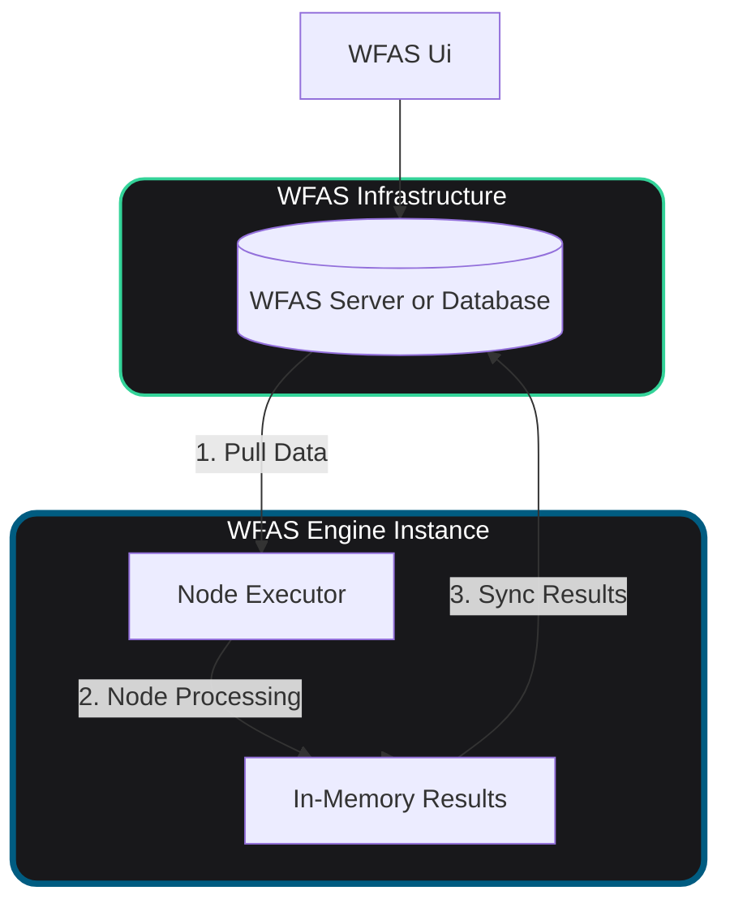
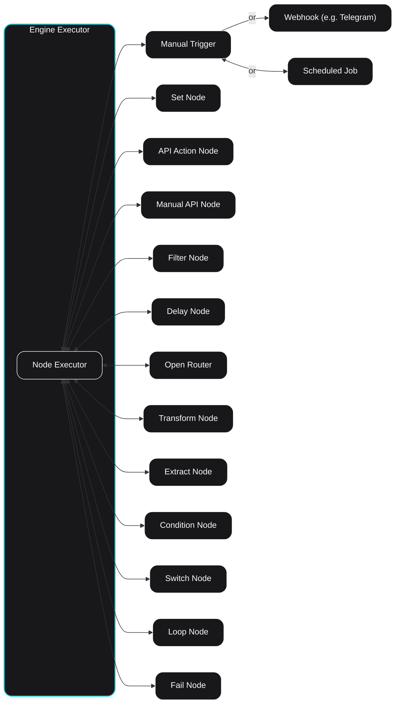

[](https://github.com/soamn/wfas)
[](https://github.com/soamn/wfas-server)
[](https://github.com/soamn/wfas-ui)


# WFAS Engine 🚀

### Workflow Automation System Engine

WFAS engine is a node-based automation engine designed to execute complex Workflow Nodes. Each Node has its executor that executes and then syncs its results with wfas-server. It runs scheduled workflows by pulling the data from the server , executing and then frees the memory.

---

## ⚙️ How the Engine Works

### System Architecture Flow



---

### Executor Working



---

## Local Setup

To Run You would need wfas-server and wfas-ui setup as well.

```
cp .env.example .env

pnpm install

pnpm run prisma:generate

pnpm run build

pnpm run start

```
